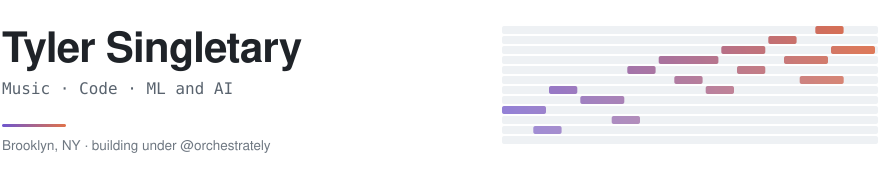

<picture>
  <source media="(prefers-color-scheme: dark)" srcset="assets/header-dark.svg">
  
</picture>

**Developer experience as product.** Twenty years building platforms that other people build on — API ecosystems, developer tooling, and now the infrastructure underneath AI agents. Currently independent, shipping under **@orchestrately**.

---

### Shipped into other people's codebases

#### [garrytan/gbrain](https://github.com/garrytan/gbrain) · ★ 28.5k

Four issues filed, all four closed as fixed. Fix for the last one merged as [#3701](https://github.com/garrytan/gbrain/pull/3701).

- A drain worker [self-deadlocking at `concurrency=1`](https://github.com/garrytan/gbrain/issues/2050), stalling any cycle phase that spawned a subagent
- [Owner identity fragmenting](https://github.com/garrytan/gbrain/issues/2465) across three different holder strings
- A [calibration default that silently no-op'd forecasting](https://github.com/garrytan/gbrain/issues/2464) on every non-owner brain
- A [cycle phase hardcoded to `source=default`](https://github.com/garrytan/gbrain/issues/3679), never scoped to the resolved id

#### [santifer/career-ops](https://github.com/santifer/career-ops) · ★ 63.9k

[#824](https://github.com/santifer/career-ops/pull/824) — `create-a-role` "gambit" mode and Speculative pipeline state.

### Open source of mine

#### [mtplx-dashboard](https://github.com/devty/mtplx-dashboard)

Realtime dashboard and activity log for local LLM inference on Apple Silicon. A small TypeScript server polls MTPLX's `/metrics` and streams to the browser over SSE; the frontend is four plain HTML files — no client framework, no build step. Surfaces the part of speculative decoding that actually matters: tokens per verify pass, per-depth acceptance, throughput, cache health.

#### [MidiTok](https://github.com/devty/MidiTok)

`StructuredREMI` and MuMIDI tokenizers extended to carry MIDI control-change data. The public edge of **Ravel AI** — an AI-first DAW that generates expressive MIDI: the dynamics, articulation, and phrasing that make a part sound played rather than entered.

#### [cohere-decisions](https://github.com/devty/cohere-decisions)

Retrieval over an organizational decision log, so "can we accept NET120 terms?" gets answered from the record instead of from memory.

### Built privately, live publicly

- **[Stockstead](https://www.stockstead.com)** — Mortgage modeling for the cases standard calculators refuse: SBLOCs, tax-loss harvesting, portfolio-backed lending.
- **[Timeblind](https://www.timeblind.today)** — Visual time-blocking for when ADHD makes the clock invisible. Gentle nudges, not guilt-trips.
- **[Forbearance](https://forbearance.fun)** — A word game that teaches you to do without.
- **Historic** — Walk up to a landmark, get an AI-narrated podcast on the spot. Fine-tuned Gemma 3 on-device, Swift and AR on top.

### Before this

- **Klout** *(2011–2016)* — Built the developer platform from zero to 7-figure ARR and 60% of company revenue; API latency from hundreds of milliseconds to ~12ms. Exit to Lithium, where I ran Klout and consumer data as VP/GM.
- **Tagboard** *(2016–2024)* — CPO through the turnaround. ARR $600K → $7.2M, churn 65% → 8%, seven products onto one platform.
- **Canvs AI** *(2018–2019)* — Rebuilt emotion and topic models from ~70% to ~85% precision/recall.
- **AWS** *(2024–2026)* — AI/ML startups. GenAI and small-model playbooks for LoRA fine-tuning and evaluation, used by founders and field teams.

Talks at APIDays NYC, APIDays Paris, API Strategy & Practice, and The Business of APIs.

---

[Portfolio](https://tyler.singletary-kodysh.com) · [Substack](https://tylersingletary.substack.com) · [LinkedIn](https://linkedin.com/in/tyler-singletary) · [@harmophone](https://x.com/harmophone)
